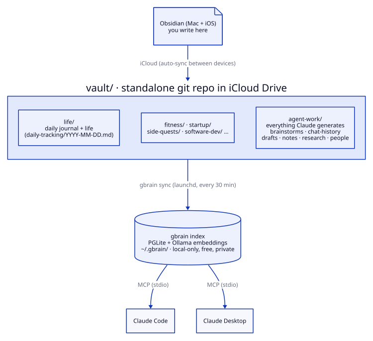
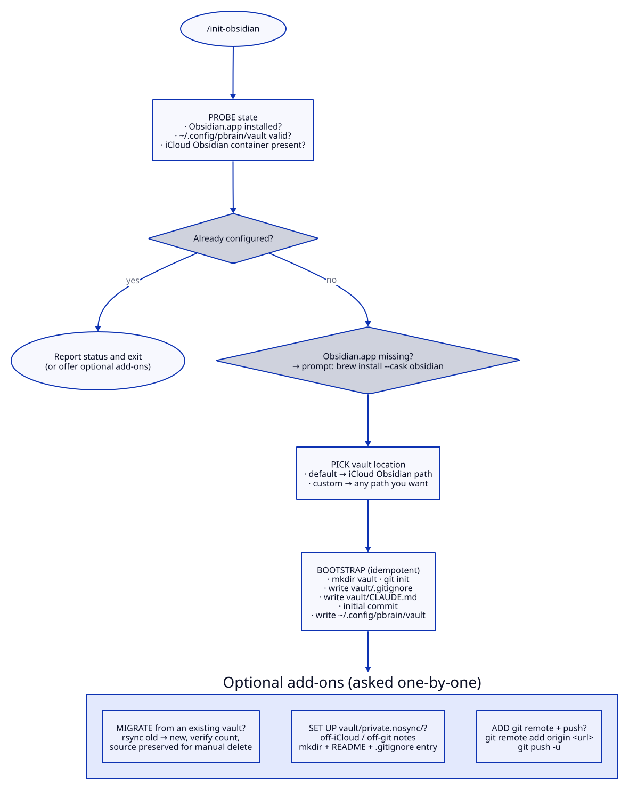
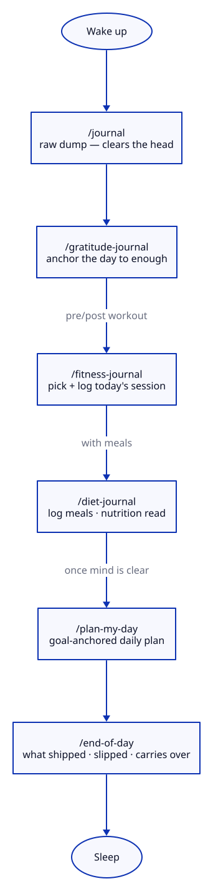
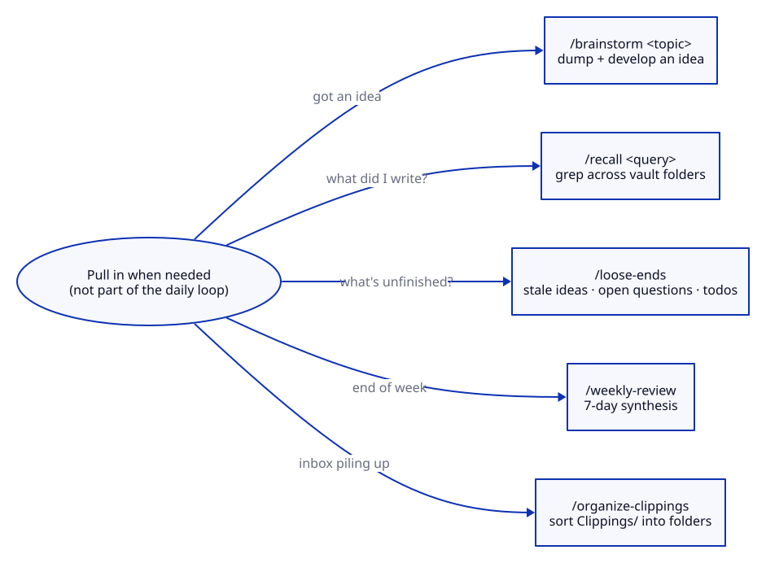

# pbrain

> **Daily-ritual scaffolding for Obsidian + Claude Code.** Local-first slash commands for journaling, gratitude, fitness, diet, daily planning, brainstorming, and clipping triage. macOS only. Your vault stays on your machine — no accounts, no servers, no telemetry.

**Obsidian** is the writing surface. A markdown **vault** is the corpus (iCloud-synced or plain local — your choice). **pbrain** slash commands handle the rituals. Optionally, **gbrain** adds an AI memory layer exposed to Claude via MCP.

**Compatibility:** macOS only (Obsidian Desktop + iCloud Drive container). iOS works for read/write through the synced vault on iPhone/iPad, but the slash commands themselves run from Claude Code on macOS. Linux, Windows, and Android aren't supported.

The pbrain slash commands work against **any** vault directory you point them at — `PBRAIN_VAULT` env var, a path written to `~/.config/pbrain/vault`, or the default iCloud Obsidian path. `/init-obsidian` handles the setup.

---

## Architecture



<!-- Source: docs/diagrams/architecture.d2 — re-render with:
     d2 --theme 0 --dark-theme 200 --pad 20 docs/diagrams/architecture.d2 docs/diagrams/architecture.svg -->

The flow:

- **Obsidian (Mac + iOS)** — where you write — syncs the **vault/** (a standalone git repo) across devices over iCloud.
- The vault holds `life/` (daily journal), domain folders (`fitness/`, `startup/`, `side-quests/`, `software-dev/`, …), and `agent-work/` (everything Claude generates — `brainstorms/`, `chat-history/`, `drafts/`, `notes/`, `research/`, `people/`).
- A launchd job runs **gbrain sync** every 30 min, indexing the vault into a local **gbrain index** (PGLite + Ollama embeddings, `~/.gbrain/` — local-only, free, private).
- **Claude Code** and **Claude Desktop** both reach that index over MCP (stdio).

---

## Quick start

The stack is three independent layers — pick what you need.

### Minimal: plugin + vault (everyone starts here)

```bash
# 1. Install the plugin — two steps (register the marketplace, then install)
/plugin marketplace add baymac/pbrain
/plugin install pbrain@pbrain
#    If either step fails, use the Local development path below — same
#    commands, just symlinked from a local clone.

# 2. Bootstrap a vault — checks for Obsidian, creates the vault,
#    optionally migrates it to iCloud for mobile sync, sets up a private
#    notes dir, writes config. Idempotent.
/init-obsidian

# 3. Start using it
/journal              # morning anchor — raw dump first, clears the head
/gratitude-journal    # then gratitude, on cleared ground (second)
/brainstorm "idea"    # quick idea dump
/plan-my-day          # goal-anchored daily planner (first run sets up your goals)
```

That's it for the core experience. `/init-obsidian` writes `~/.config/pbrain/vault` so every other command knows where to write.

### What `/init-obsidian` does

First-run setup — you only need it once. Every other command reads `~/.config/pbrain/vault` and just works after this is done. Re-running is safe (idempotent) but only useful if you're switching vault locations, adding a git remote later, or adding the private dir after the fact.



<!-- Source: docs/diagrams/init-obsidian.d2 — re-render with:
     d2 --theme 0 --dark-theme 200 --pad 20 docs/diagrams/init-obsidian.d2 docs/diagrams/init-obsidian.svg -->

Step by step:

1. **PROBE state** — checks whether Obsidian.app is installed, `~/.config/pbrain/vault` is valid, and the iCloud Obsidian container is present.
2. **Already configured?** → if yes, report status and exit (or offer the optional add-ons below).
3. **Obsidian.app missing?** → prompt `brew install --cask obsidian`.
4. **PICK vault location** — default (`~/Library/Mobile Documents/iCloud~md~obsidian/Documents/vault`) or any custom path.
5. **BOOTSTRAP** (idempotent — re-running on an existing vault leaves it alone): `mkdir` the vault dir, `git init`, write `vault/.gitignore` (`.gbrain/`, `.DS_Store`, `private.nosync/`), write `vault/CLAUDE.md` (project-level CC instructions for sessions opened inside the vault — *not* slash commands, those live in `~/.claude/commands`), initial commit, then write `~/.config/pbrain/vault` (the pointer every other command reads).
6. **Optional add-ons** (asked one-by-one): MIGRATE from an existing vault (rsync old → new, verify file count, source preserved for manual delete); SET UP `vault/private.nosync/` for off-iCloud / off-git notes; ADD a git remote + push.

**What's written inside the vault:** `vault/.gitignore`, `vault/CLAUDE.md`, optionally `vault/private.nosync/README.md`. That's it. Slash commands are *never* installed into the vault — they live in `~/.claude/commands` (via `/plugin install` or `scripts/install-commands.sh`).

**What's written outside the vault:** `~/.config/pbrain/vault` (one-line text file with the vault path).

### Local development

Clone the repo and run the install script — it symlinks each command into `~/.claude/commands/` individually, so every CC session anywhere picks them up with no re-install, and any non-pbrain commands you already have there are preserved:

```bash
git clone https://github.com/baymac/pbrain.git ~/code/pbrain
~/code/pbrain/scripts/install-commands.sh
```

The script is idempotent — re-run it after `git pull` if new commands land. If you previously symlinked the whole `commands/` directory, the script detects that and replaces it with per-file links.

The install script also makes **live edits to `.sh` scripts take effect immediately**: it registers your clone as `PBRAIN_DEV_DIR` in `~/.claude/settings.json`, so the command wrappers always execute from your live repo instead of the marketplace snapshot. Restart Claude Code / Conductor once after the first install for the env change to load. `scripts/uninstall-commands.sh` removes that entry again (only if it still points at this clone).

> Prefer `settings.json` over a `~/.zshrc` export here: GUI-launched apps (Conductor, the desktop app) don't source `~/.zshrc`, so a shell-profile export is invisible to them — the wrappers fall back to the stale marketplace snapshot and your edits don't run. The `settings.json env` block is read regardless of how the app was launched. The install script writes it for you, but if you set it by hand, put it there.

Run pbrain commands from **any directory** — your current project, a Conductor workspace, the tooling repo, wherever you are. The vault path is resolved from your config (`$PBRAIN_VAULT` → `~/.config/pbrain/vault` → iCloud default), never from cwd. Notes always land in the right place.

#### Troubleshooting

Commands not showing up after running the install script?

1. **Restart Claude Code.** Slash commands are loaded at session start; sessions opened before the symlinks existed won't see them.
2. **Stale startup cache.** Rare, but if a full restart still doesn't surface them: `rm ~/.claude/.last-cleanup` and restart CC.
3. **Broken symlinks.** If you deleted or moved the cloned repo, the per-file symlinks under `~/.claude/commands/` will be dangling. Re-clone and re-run `scripts/install-commands.sh`.

---

## Vault structure

User-curated topical folders live at the root. Claude-generated content lives under `agent-work/`.

| Directory | What goes here |
|---|---|
| `life/daily-tracking/` | Daily journal entries (created by `/journal`) |
| `life/`, `fitness/`, `startup/`, `notes/`, etc. | Your hand-curated topical folders (whatever shape you want) |
| `agent-work/brainstorms/tbd/` | `/brainstorm` outputs (active, default landing). |
| `agent-work/brainstorms/backlog/` | Parked ideas — not now, not dropped. |
| `agent-work/brainstorms/done/` | Actioned, shipped, or set aside. |
| `agent-work/chat-history/` | Chat takeaways saved on request |
| `agent-work/drafts/` | Drafts written by Claude |
| `agent-work/notes/` | Misc agent-captured notes |
| `agent-work/research/` | Web summaries, research outputs |
| `agent-work/people/` | People pages (auto-enriched or hand-written) |

Concepts, sources, ideas, etc. are **co-located** with their topic — e.g. `startup/<your-app>/ideas/`, `side-quests/<your-hobby>/sources/` — not at the vault root.

---

## Slash commands

Packaged as the **pbrain** Claude plugin (manifest at `.claude-plugin/plugin.json`). One short doc per command under [`docs/`](docs/).

| Command | What it does | Default path |
|---|---|---|
| `/journal` | Today's daily note | `$VAULT/life/daily-tracking/` |
| `/gratitude-journal` | Gratitude + reflection (runs after `/journal`) | `$VAULT/life/gratitude-journal/` |
| `/plan-my-day` | Goal-anchored daily planner | `$VAULT/life/daily-planning/` |
| `/end-of-day` | Close-of-day reflection (bookend to `/plan-my-day`) | fills `## How it went` in `$VAULT/life/daily-planning/<date>.md` (in place) |
| `/weekly-review` | 7-day synthesis across journal, gratitude, plan, fitness, diet | `$VAULT/life/weekly-tracking/YYYY-Www.md` |
| `/brainstorm <topic>` | New brainstorm file | `$VAULT/agent-work/brainstorms/tbd/` |
| `/recall <topic>` | Grep-based search across vault narrative folders | (read-only — prints matches) |
| `/loose-ends` | Surfaces stale ideas, open questions, todos, deferred seeds, focus drift | (read-only — surfacing dashboard) |
| `/habits` | Track habits to build or cap; patterns vs caps; auto-logged from your journals | `$VAULT/life/Habits Profile.md` + local DB |
| `/remind <text>` | Reminders that fire as macOS notifications; ride along with plan/end-of-day | local SQLite DB (no vault file) |
| `/diet-journal` | Diet log + nutrition analysis + named-food library | `$VAULT/fitness/diet-tracking/` |
| `/fitness-journal` | Adaptive workout for today | `$VAULT/fitness/daily-tracking/` |
| `/organize-clippings` | Sort `Clippings/` into the right folders | source: `$VAULT/Clippings/` |

### Daily flow

The commands compose into a full-day ritual. Run them top-to-bottom — most are zero-input, just type the slash command and answer the prompts.



<!-- Source: docs/diagrams/daily-flow.d2 — re-render with:
     d2 --theme 0 --dark-theme 200 --pad 20 docs/diagrams/daily-flow.d2 docs/diagrams/daily-flow.svg -->

| When | Command | What you do |
|---|---|---|
| Morning, before anything else | `/journal` | Raw dump first: today's mood, yesterday's residue, random thoughts, whatever's loud. Then answer the open questions it asks. Clears the head. |
| Right after journaling | `/gratitude-journal` | Just run it — answers the prompts. With the head cleared, gratitude anchors the day to *enough* before agent work starts. |
| Pre/post workout | `/fitness-journal` | Just run it — it picks today's session based on your activity rotation and asks you to log sets/reps. |
| With meals (or end of day) | `/diet-journal` | Just run it — log what you ate, get a nutrition + plan-adherence read. |
| Once mind is clear | `/plan-my-day` | Just run it — goal-anchored daily plan. First run sets up your goals; subsequent runs reuse them. |
| End of day | `/end-of-day` | Just run it — close-of-day reflection. Bookends `/plan-my-day`: what shipped, what slipped, what carries over. |

`/brainstorm <topic>`, `/recall <query>`, `/loose-ends`, `/weekly-review`, `/habits`, `/remind <text>`, and `/organize-clippings` are on-demand — not part of the daily loop. Pull them in when needed. (`/habits` and `/remind` also surface automatically inside `/plan-my-day` and `/end-of-day`, and habits get logged from your journaling sessions without you asking.)



<!-- Source: docs/diagrams/on-demand.d2 — re-render with:
     d2 --theme 0 --dark-theme 200 --pad 20 docs/diagrams/on-demand.d2 docs/diagrams/on-demand.svg -->

Each command's default path is overrideable via env var. Full reference:

| Env var | Used by | Default |
|---|---|---|
| `PBRAIN_DEV_DIR` | all commands | — (see Local dev below) |
| `PBRAIN_VAULT` | all | iCloud Obsidian path |
| `PBRAIN_SELF_IMPROVE` | all commands (self-improve loop) | `prefs` — also `off` (disable) or `dev` (propose source edits; needs `PBRAIN_DEV_DIR`) |
| `PBRAIN_PREFS_DIR` | all commands (per-command preferences) | `~/.config/pbrain/prefs` |
| `PBRAIN_FEEDBACK_DIR` | all commands (quality-fix capture) | `~/.config/pbrain/feedback` |
| `PBRAIN_DB_FILE` | `/habits`, `/remind` (shared SQLite store: habit events + reminders) | `~/.config/pbrain/pbrain.db` |
| `PBRAIN_JOURNAL_DIR` | `/journal`, read by `/plan-my-day`, `/loose-ends` | `$VAULT/life/daily-tracking` |
| `PBRAIN_BRAINSTORMS_DIR` | `/brainstorm`, read by `/loose-ends` | `$VAULT/agent-work/brainstorms` |
| `PBRAIN_DIET_DIR` | `/diet-journal` | `$VAULT/fitness/diet-tracking` |
| `PBRAIN_DIET_PLAN_FILE` | `/diet-journal` | `$VAULT/fitness/Diet Plan.md` |
| `PBRAIN_DIET_PROFILE_FILE` | `/diet-journal` | `~/.config/pbrain/diet-profile.json` |
| `PBRAIN_FOOD_LIBRARY_FILE` | `/diet-journal` (named-food library — log by name) | `$VAULT/fitness/Food Library.md` |
| `PBRAIN_FITNESS_DIR` | `/fitness-journal`, read by `/diet-journal`, `/plan-my-day` | `$VAULT/fitness/daily-tracking` |
| `PBRAIN_GYM_PLAN_FILE` | `/fitness-journal` | `$VAULT/fitness/Gym Plan.md` |
| `PBRAIN_FITNESS_PLANS_DIR` | `/fitness-journal` | `$VAULT/fitness/plans` |
| `PBRAIN_FITNESS_ACTIVITIES_FILE` | `/fitness-journal` | `~/.config/pbrain/fitness-activities.json` |
| `PBRAIN_GRATITUDE_DIR` | `/gratitude-journal` | `$VAULT/life/gratitude-journal` |
| `PBRAIN_PLAN_DIR` | `/plan-my-day`, `/end-of-day`, `/weekly-review`, `/loose-ends` | `$VAULT/life/daily-planning` |
| `PBRAIN_PLAN_PROFILE_FILE` | `/plan-my-day`, read by `/loose-ends`, `/weekly-review` | `$VAULT/life/Goals Profile.md` (markdown; JSON in a fenced block) |
| `PBRAIN_HABITS_PROFILE_FILE` | `/habits`, read by `/plan-my-day`, `/end-of-day`, `/weekly-review` | `$VAULT/life/Habits Profile.md` (markdown; JSON in a fenced block) |
| `PBRAIN_WEEKLY_DIR` | `/weekly-review` | `$VAULT/life/weekly-tracking` |
| `PBRAIN_RECALL_SCOPE` | `/recall` | `life agent-work startup side-quests software-dev notes` (space-separated subdirs relative to vault) |
| `PBRAIN_STALE_DAYS` | `/loose-ends` | `7` (age at which an item counts as stale) |
| `PBRAIN_LOOSE_ENDS_LOOKBACK` | `/loose-ends` | `30` (days of journals/plans to scan) |
| `PBRAIN_CLIPPINGS_DIR` | `/organize-clippings` | `$VAULT/Clippings` |
| `PBRAIN_CLIPPINGS_TARGETS` | `/organize-clippings` | (interactive prompt — set to `all` or a comma-separated subset to skip it) |

The vault root is resolved via `PBRAIN_VAULT` → `~/.config/pbrain/vault` → default iCloud path, in that order.

---

## Private notes

If you went with the iCloud-synced vault, you can keep notes off git **and** off iCloud using the `.nosync` suffix convention. `/init-obsidian` offers to set up `vault/private.nosync/` automatically.

---

## Optional: gbrain (AI search over the vault) — 🚧 not working, fix coming in a future release

gbrain adds hybrid vector + keyword search and exposes it to Claude via MCP — so Claude can recall what you wrote weeks ago. **Not required for any of the commands above.**

> 🚧 **Currently broken.** A recent upstream schema migration causes the scheduled launchd sync to hang. The brain only stays fresh while Claude is open (MCP writes go through `gbrain serve` in-process); scheduled background sync is **disabled by default**. Skip this section for now — everything else in pbrain works without it. **Will be fixed in a future release.** Details: [`gbrain/docs/gbrain-sync.md`](gbrain/docs/gbrain-sync.md) · upstream repro: [`gbrain/docs/gbrain-bug-report.md`](gbrain/docs/gbrain-bug-report.md).

```bash
brew install ollama && brew services start ollama && ollama pull nomic-embed-text
git clone https://github.com/garrytan/gbrain.git ~/code/gbrain
cd ~/code/gbrain && bun install && bun link
cd "$(cat ~/.config/pbrain/vault)" && gbrain init --pglite --embedding-model ollama:nomic-embed-text --embedding-dimensions 768
gbrain config set embedding_model ollama:nomic-embed-text
gbrain sync --repo . --skip-failed
claude mcp add gbrain "$HOME/.bun/bin/gbrain" serve
# Optional (currently degraded — see note above):
# ./gbrain/scripts/install-launchd.sh
```

Full setup: [`gbrain/docs/setup.md`](gbrain/docs/setup.md). What gbrain unlocks beyond search: [`gbrain/docs/gbrain-beyond-notes.md`](gbrain/docs/gbrain-beyond-notes.md).

---

## Repository structure

The repo *is* the plugin — a single-plugin Claude marketplace would just nest the same files under `plugins/pbrain/` for no gain. `gbrain/` stays separate because it's not part of the plugin distribution; it's local sync glue.

```
pbrain/
├── .claude-plugin/
│   └── plugin.json                     ← Claude plugin manifest
├── commands/                           ← .md + .sh pairs for each slash command
├── lib/
│   └── vault.sh                        ← shared VAULT_DIR resolver, sourced by each command
├── docs/                               ← one short doc per command (user-facing)
├── gbrain/                             ← gbrain ops (sync, launchd, docs)
│   ├── scripts/
│   │   ├── install-launchd.sh          ← render plist + load launchd
│   │   ├── gbrain-sync-wrapper.sh      ← wraps sync with lockfile + JSONL log
│   │   ├── gbrain-dashboard.sh         ← stuck procs, sync stats, brain stats
│   │   └── gbrain-upgrade.sh           ← bun-link based upgrade flow
│   ├── launchd/
│   │   └── com.pbrain.sync.plist.template
│   ├── docs/
│   │   ├── setup.md                    ← gbrain-only setup (Ollama, init, MCP, launchd)
│   │   ├── gbrain-sync.md              ← sync architecture + lock model
│   │   ├── gbrain-beyond-notes.md      ← capabilities beyond search
│   │   └── gbrain-bug-report.md        ← upstream bug repro
│   └── .logs/                          ← gitignored: sync-runs.jsonl, upgrade-status.json
├── CLAUDE.md
└── README.md
```

The vault is a **separate** git repo (or just a directory). Not a submodule of this repo.

---

## Pairs well with

[**Claudian**](https://github.com/YishenTu/claudian) — an Obsidian plugin that runs Claude Code **inside** Obsidian, with word-level diff previews, vault-wide search, and three safety modes (Safe / Plan / YOLO). pbrain pushes structured notes *into* the vault from Claude Code on the terminal; Claudian lets Claude read, edit, and connect notes *inside* the Obsidian UI itself. The two are complementary — install both and you can write a `/journal` entry from the terminal, then ask Claude to enrich and backlink it inside Obsidian without leaving the editor.

---

## License

MIT — see [LICENSE](LICENSE).

---

## What not to do

- Don't write notes in this outer repo — use the vault
- Don't bypass the global `~/.claude/commands` symlink with per-vault copies — edit `commands/` here and every session picks up the change.
- Don't put gbrain scripts inside `commands/` or `lib/` (or pbrain scripts inside `gbrain/`). Plugin = slash commands. Gbrain ops = `gbrain/`.
- Don't `bun install -g github:garrytan/gbrain` — broken postinstall hook; clone and link manually (see `gbrain/docs/setup.md`)
- Don't init gbrain at the pbrain root — it'll index your scripts as notes. Always init from inside the vault.
